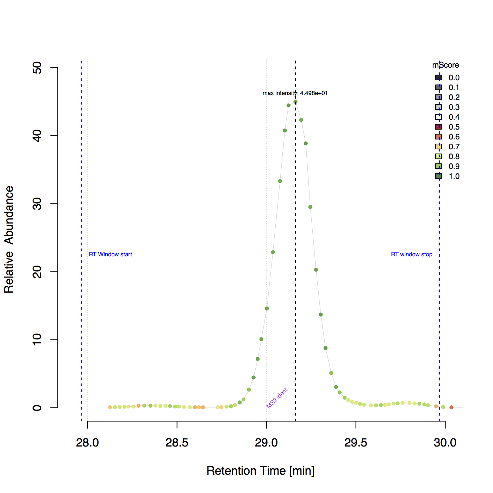
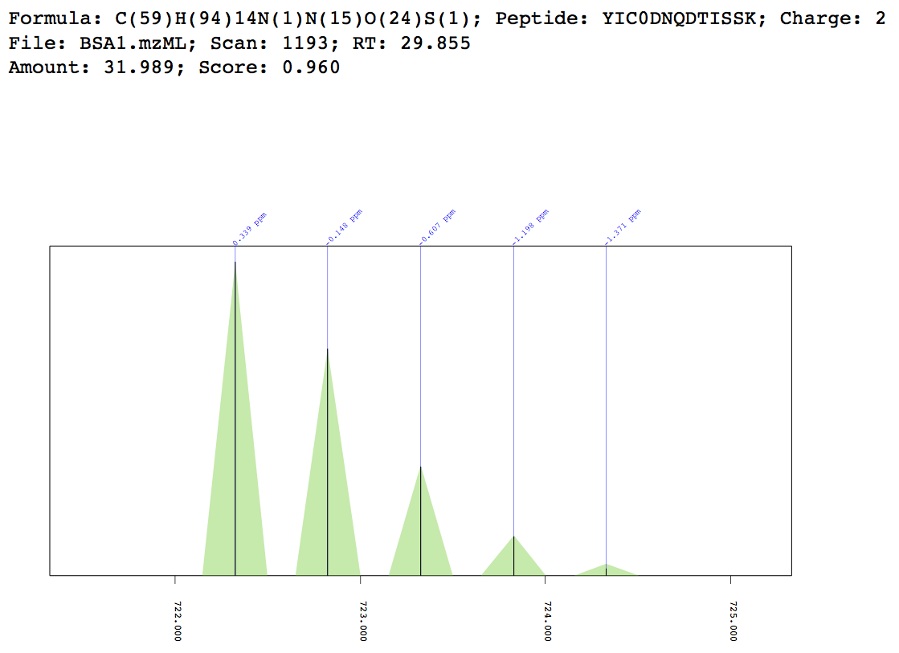
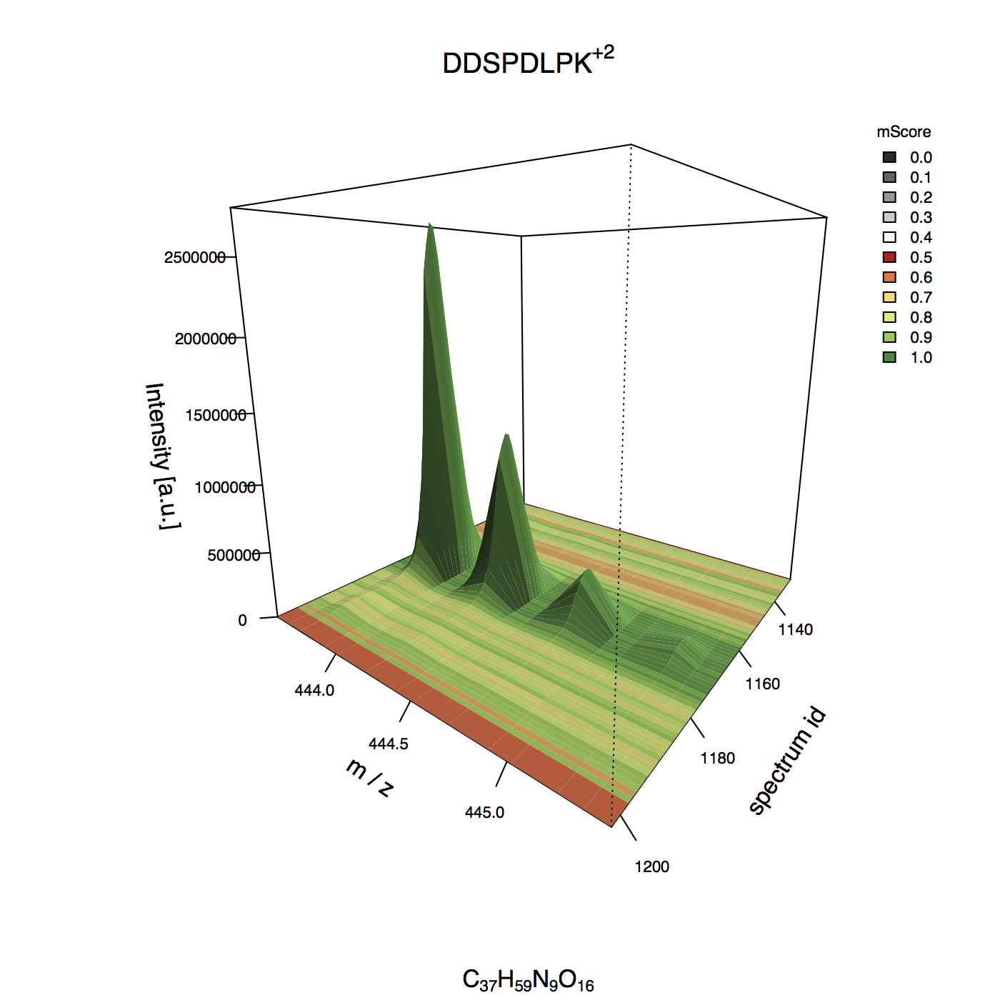

.. example_scripts:

.. _example scripts:

Example Scripts
===============

General and quick start
^^^^^^^^^^^^^^^^^^^^^^^

.. _get bsa file:

Get the BSA example mzML file
-----------------------------

.. autofunction:: get_example_BSA_file.main

.. include:: code_inc/get_example_BSA_file.inc

Basic usage
^^^^^^^^^^^

Parse ident file and quantify
-----------------------------

.. autofunction:: parse_ident_file_and_quantify.main

.. include:: code_inc/parse_ident_file_and_quantify.inc

Simple match on peak list
-------------------------

.. autofunction:: basic_quantification_example.main

.. include:: code_inc/basic_quantification_example.inc

View result pkl stats
---------------------

.. autofunction:: view_result_pkl_stats.main

.. include:: code_inc/view_result_pkl_stats.inc

Access the result class
-----------------------

.. autofunction:: access_result_class.main

.. include:: code_inc/access_result_class.inc

Generate quant summary file
---------------------------

.. autofunction:: generate_quant_summary_file.main

.. include:: code_inc/generate_quant_summary_file.inc

Write raw quant results as csv
------------------------------

.. autofunction:: write_raw_result_csv.main

.. include:: code_inc/write_raw_result_csv.inc

Write results as mzTab
----------------------

.. autofunction:: write_mztab_result.main

.. include:: code_inc/write_mztab_result.inc

Write results as mzTab (BSA example)
------------------------------------

.. autofunction:: write_BSA_mztab_results.main

.. include:: code_inc/write_BSA_mztab_results.inc

Advanced usage
^^^^^^^^^^^^^^

Parse ident file and quantify (with CAM)
----------------------------------------

.. autofunction:: parse_ident_file_and_quantify_with_carbamidomethylation.main

.. include:: code_inc/parse_ident_file_and_quantify_with_carbamidomethylation.inc

Complete quantification - from identification csv to peptide abundances
-----------------------------------------------------------------------

.. autofunction:: complete_BSA_quantification.main

.. include:: code_inc/complete_BSA_quantification.inc

Example plot including RT borders and identification information
""""""""""""""""""""""""""""""""""""""""""""""""""""""""""""""""

Example plot for peptide 'DDSPDLPK' with charge 2 in the BSA1.mzML file.

Plotting and visualizattion
^^^^^^^^^^^^^^^^^^^^^^^^^^^

Plot example match
------------------

.. autofunction:: plot_match_examples.main

.. include:: code_inc/plot_match_examples.inc

Example match plot
""""""""""""""""""

MIC 3D plot
-----------

.. autofunction:: mic_3d_plot.main

.. include:: code_inc/mic_3d_plot.inc

Example 3D plot
"""""""""""""""

MIC 2D plot
-----------

.. autofunction:: mic_2d_plot.main

.. include:: code_inc/mic_2d_plot.inc

Example 2D plot
"""""""""""""""

.. image:: images/mic_2d.png

Determine m/z and intensity errors
----------------------------------

.. autofunction:: determine_mz_and_i_error.main

.. include:: code_inc/determine_mz_and_i_error.inc

Visualize errors on spectrum level
----------------------------------

.. autofunction:: visualize_scoring_information.main

.. include:: code_inc/visualize_scoring_information.inc

