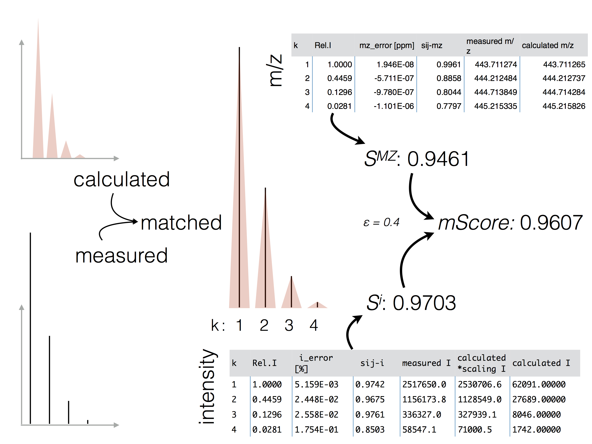

.. faq:

.. _Ursgal:
    https://github.com/ursgal/ursgal

Frequently asked questions
==========================

Q: What are the hardware requirements for pyQms?
^^^^^^^^^^^^^^^^^^^^^^^^^^^^^^^^^^^^^^^^^^^^^^^^

A: pyQms can be run on any (more or less up to date) computer supporting
macOS, Linux or Windows and Python version 3.4+. Fast access to spectra
is beneficial for the overall performance (e.g. mzML files stored on SSDs).
In our experience, slow HDDs (also reading multiple files at the same time from
the same HDD or network resource) are most of the time the limiting factor 
during large scale quantification.

Please consider that the RAM usage dependens on the number of input molecules, 
charges and labeling percentiles. Some examples are given below.

 ================= ====== ======================== ========
 Molecules #       Charge label percentiles        RAM [GB]     
 ================= ====== ======================== ========
 1000              1-5    None                     0.13
 10000             1-5    None                     0.92
 20000             1-5    None                     1.76
 30000             1-5    None                     2.62
 10000             1-5    15N 0.0, 0.99            1.90
 100               1-5    15N 0.0-0.99, 0.01 steps 1.78            
 ================= ====== ======================== ========

Q: What data/file formats are accepted by pyQms?
^^^^^^^^^^^^^^^^^^^^^^^^^^^^^^^^^^^^^^^^^^^^^^^^^

A: pyQms accepts simple peak lists consisting of m/z and intensity pairs. E.g. ::

    peak_list = [ 
        ( mz_1, intensity_1 ),
        ( mz_2, intensity_2 ),
        ( mz_n, intensity_n ),
        ... 
    ]

Depending on the reader/access to the file format, any input format can be used 
(mzML, mzXML, RAW, mgf, dta, ...). pyQms comes with pymzML as a dependency, as
access to the standard format for mass spectrometry, mzML. It is beneficial, if
apart from the peak list also the retention time and the spectrum ID can be
provided to pyQms to make data processing and evaluation more straightforward for
the user. pyQms comes also with an adaptor to Ursgal (`Ursgal`_) identification 
csv files, for automated parsing of peptides and modifications.

Q: Does the input data need to be processed?
^^^^^^^^^^^^^^^^^^^^^^^^^^^^^^^^^^^^^^^^^^^^^

A: We leave data pre-processing completely on the user side. However, spectra 
data needs to be centroided. 
In the example scripts we use pymzML for data centroiding, if
the spectra were not already centroided by e.g. Proteome Discoverer or msconvert
implemented in Proteowizard.

Q: How should my (input) molecules look like?
^^^^^^^^^^^^^^^^^^^^^^^^^^^^^^^^^^^^^^^^^^^^^

A: pyQms accepts different formats of input molecules. Please refer to the
documentation of the :py:class:`pyqms.IsotopologueLibrary` for further details.

Input molecules can be plain peptides (also with modifications in unimod style)
or molecular formulas. Please provide multiple molecules in a Python list: ::

    'PEPTIDE'
    'PEPTIDE+HPO3'
    'PEPTIDE#Oxidation:1;Phospho:4'
    '+H2O'

Q: Is high resolution and low resolution data supported?
^^^^^^^^^^^^^^^^^^^^^^^^^^^^^^^^^^^^^^^^^^^^^^^^^^^^^^^^

A: Since resolved isotope patterns are required, only high resolution data can
be processed. The precision can be adjusted in the parameters (`REL_MZ_RANGE`). 
As default, 5 ppm are used (See: :ref:`parameter section`).

Q: Why should I use pyQms to analyze my data?
^^^^^^^^^^^^^^^^^^^^^^^^^^^^^^^^^^^^^^^^^^^^^^

A: pyQms offers a unique way to quantify all kind of mass spectrometry data
including  metabolomics, lipidomics and proteomics. All kind of labelings (even
completely novel) can be defined and quantified. In contrast to many other
algorithms, pyQms will report a score directly reflecting the quanlity of the
match, providing the user with useful information and enabling the calculation
of FDRs. As a rule-of-thumb, an mScore of 0.7 yields an FDR <= 1% for standard 
approaches (e.g. label-free or metabolic labeling with 15N). Further, pulse
chase data can be analyzed and evaluated. Last but not least, pyQms compares
favourably to other popular quantification algorithms in terms of accuracy and
sensitivity.

Q: How can i adjust pyQms parameters to my mass spectrometer?
^^^^^^^^^^^^^^^^^^^^^^^^^^^^^^^^^^^^^^^^^^^^^^^^^^^^^^^^^^^^^^

A: Genereally, now extensive adjustements are required. It is normally sufficient
to use the default parameters. For further specifications please refer to the 
:ref:`parameter section` section. Most importantly the `REL_MZ_RANGE` has to
be set according to the mass spectrometer's accuracy.

Q: Where can I find my final peptide and protein abundances of my LC-MS/MS runs?
^^^^^^^^^^^^^^^^^^^^^^^^^^^^^^^^^^^^^^^^^^^^^^^^^^^^^^^^^^^^^^^^^^^^^^^^^^^^^^^^^

A: In pyQms, we offer, on purpose however, no direct estimation of peptide or
even protein abundances. We believe, that the user should use the raw quantification
data provided by pyQms and determine the abundance with own functions. However, 
pyQms offers adaptors to read in peptide identification results and use this
information to set RT windows and determine e.g. the maximum intensity within
this window. Please refer to the :ref:`example scripts` and :ref:`adaptors` 
sections for further information and usage examples. We want to keep pyQms open
for programmers and tailor the abundance estimation to their needs.

Q: Are there any known issues/problems etc. ?
^^^^^^^^^^^^^^^^^^^^^^^^^^^^^^^^^^^^^^^^^^^^^^

A: So far, no crucial issues or problems were reported. If you encounter any
problem feel free to add an issue at GitHub (https://github.com/pyQms/pyqms).

Q: What are the benefits of using pyQms?
^^^^^^^^^^^^^^^^^^^^^^^^^^^^^^^^^^^^^^^^^

A: Besides using a very accurate quantification tool, which is freely available
and universally applicable, you and your data will benefit from the concept of
the mScore, which adds a new layer of quality assurance to your data analysis. 

Q: How does the scoring work? How is the mScore determined?
^^^^^^^^^^^^^^^^^^^^^^^^^^^^^^^^^^^^^^^^^^^^^^^^^^^^^^^^^^^

A: Please refer to the documentation of :py:class:`pyqms.IsotopologueLibrary`
and the publicationfor details on the scoring. 
The figure below highlights the principle of the
mScore and the final score determination originating from the m/z and intensity
accuracy scoring.

Q: How can I contribute to the further development of pyQms?
^^^^^^^^^^^^^^^^^^^^^^^^^^^^^^^^^^^^^^^^^^^^^^^^^^^^^^^^^^^^^

A: Feel free to clone or fork pyQms from GitHub (https://github.com/pyQms/pyqms) 
and place pull request for your adjustements/improvements/recommendations! 
Another way is to open an issue at GitHub and let us try to fix it and help you.

Q: I have a problem/issue regarding pyQms, where can I find help?
^^^^^^^^^^^^^^^^^^^^^^^^^^^^^^^^^^^^^^^^^^^^^^^^^^^^^^^^^^^^^^^^^^

You can mail us or open an issue at GitHub (https://github.com/pyQms/pyqms) 
describing your problem/question etc.!
We will try to help you.
